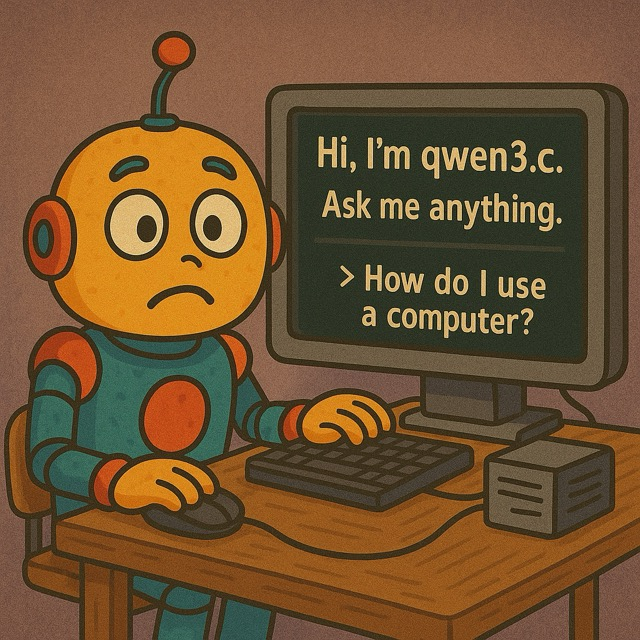

## qwen3.c

<p align="center">
  
</p>

**Run inference for frontier models based on the Qwen3 architecture, like Qwen3-4B or DeepSeek-R1-0528-Qwen3-8B, on your local Linux/macOS/Windows machine. No complicated configuration
required, just follow the steps below and enjoy.**

**Understand the basics of transformers but want to learn in-depth how LLM inference works? qwen3.c runs LLMs using one easy-to-understand (relatively speaking!) file of C source with no dependencies. Once you've
digested it and understand the data flow, you're there.**

This project's starting point was Andrej Karpathy's [llama2.c](https://github.com/karpathy/llama2.c), which does single-file
inference for LLaMA 2-compatible models. The LLaMA 2 architecture is now 2 years old (a lifetime in the field of AI) and is
long superseded. This project aims to maintain the simplicity of llama2.c while supporting a frontier
model architecture, with the goal of being both an up-to-date learning resource and also a great way to run the latest models locally.

Despite being only around 1000 lines of C code with no dependencies, qwen3.c supports everything you need to
enjoy running leading Qwen3-architecture LLMs on standard hardware (no GPUs needed), including multi-CPU core operation, support for Unicode/multi-language input and output, and thinking/reasoning models.

qwen3.c includes a Python tool to process any Qwen3-architecture HuggingFace model, converting to qwen3.c's model format which uses Q8_0 quantization for a good trade-off between quality
and performance.

## Step 1: checkout and build

First, checkout this repo and build it. I recommend the OpenMP version if your toolchain supports it, as it supports multiple CPU
cores for dramatically improved performance:

```aiignore
git clone https://github.com/adriancable/qwen3.c
cd qwen3.c
make openmp
```

(To build without OpenMP, just run `make` without the `openmp` argument.)

## Step 2: download and convert a model

First, make sure `git` is set up with your HuggingFace credentials (now is a great time to create a
HuggingFace account if you don't have one).

Then, download any dense (no Mixture-of-Experts) unquantized (not GGUF) Qwen3-architecture model from HuggingFace.
Unless you have lots of RAM, start with smaller models.

Qwen3-4B is a great starting point:

```aiignore
git clone https://huggingface.co/Qwen/Qwen3-4B
```

Then run the Python 3 export tool (will take around 10 minutes) to convert to qwen3.c's quantized checkpoint format, storing in
a file called `Qwen3-4B.bin`:

```aiignore
python export.py Qwen3-4B.bin ./Qwen3-4B
```

## Step 3: run and enjoy

```aiignore
./runq Qwen3-4B.bin
```

Fun things you can try asking:

> Tell me a surprising fact about an animal of your choice.

> Write a short story for a 5 year old girl, featuring Sobieski the dog and Pepe the cat.

> Write a C program which sorts a list using the bubble sort algorithm.

> Write a poem about a little boy who builds a rocket to fly to the moon. In Japanese, please.

> Translate into English: 我希望您喜欢使用 qwen3.c 学习 LLM。

## Step 4: experiment with reasoning mode

qwen3.c also supports reasoning/thinking, if the model used supports it. Enable thinking with the `-r 1` command line parameter:

```aiignore
./runq Qwen3-4B.bin -r 1
```

Then try:

> Solve the quadratic equation x^2 - 5x + 6 = 0.

> What is 19673261 * 1842.64?

## Step 5: explore other models

Try for example DeepSeek-R1-0528-Qwen3-8B:

```aiignore
git clone https://huggingface.co/deepseek-ai/DeepSeek-R1-0528-Qwen3-8B
python export.py DeepSeek-R1-0528-Qwen3-8B.bin ./DeepSeek-R1-0528-Qwen3-8B
```

Then:

```aiignore
./runq DeepSeek-R1-0528-Qwen3-8B.bin
```

## Advanced options

qwen3.c lets you configure model settings via the command line including setting a system prompt, setting temperature, sampling parameters and so forth.
To show available settings, run qwen3.c without any command-line parameters:

```aiignore
./runq
```

## License

MIT
